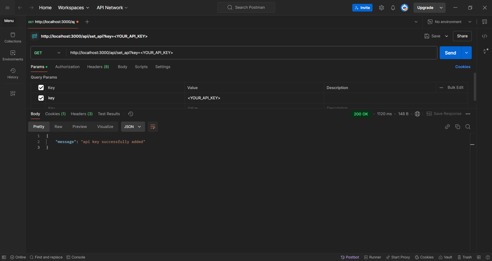
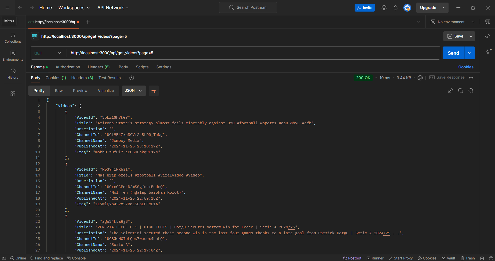
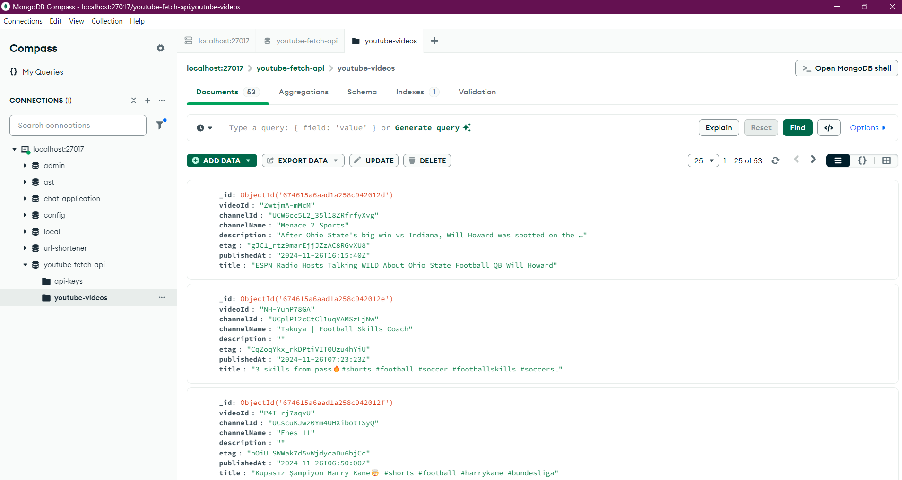

# YouTube Videos Fetcher

This project is a Golang-based server designed to interact with the YouTube API. It fetches video data periodically, stores it in a database asynchronously, and provides an endpoint to retrieve stored videos in a paginated format.

---

## Features

1. **YouTube API Integration**:
   - Periodically fetches video data.
   - Uses Etag headers to detect changes and updates the database in bulk.

2. **Database Operations**:
   - Supports asynchronous updates for efficiency.
   - Provides paginated video retrieval.

3. **Endpoints**:
   - Set YouTube API key for fetching video data.
   - Fetch paginated video data from the database.

---
## Optimization
  - **Etag Header**: Utilizes Etag headers from YouTube API responses to efficiently detect and update only modified video records.
  - **Bulk Updates**: Ensures optimized database operations by performing updates in bulk for changed records.


### Examples
1. Add Api
   ```bash
   curl -X Get -H "Content-Type: application/json" http://localhost:3000/api/set_api?key=<ADD_YOUR_API_KEY>
   ```
   
2. Search Videos
   ```bash
   curl -X Get -H "Content-Type: application/json" http://localhost:3000/get_videos?page=1
   ```
   
3. Database
   